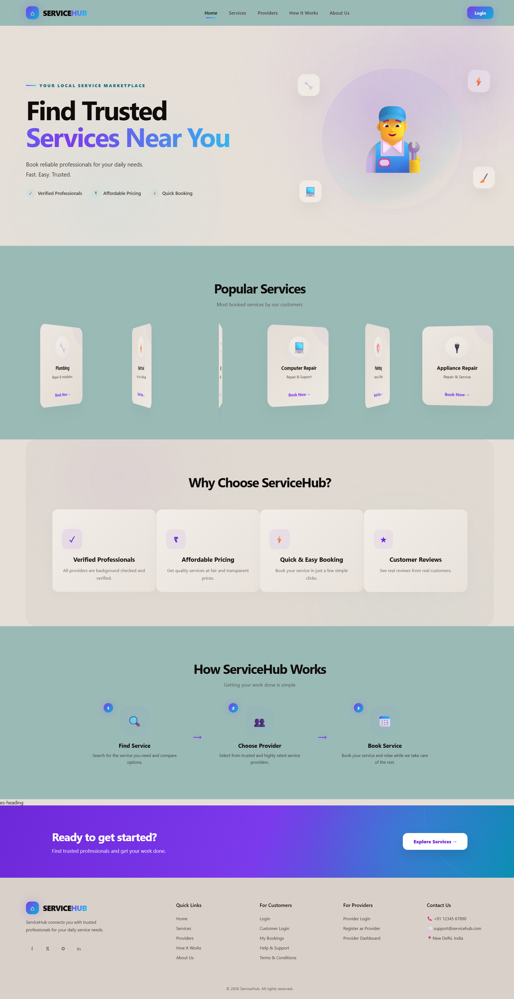
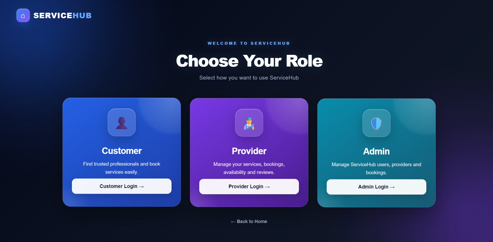
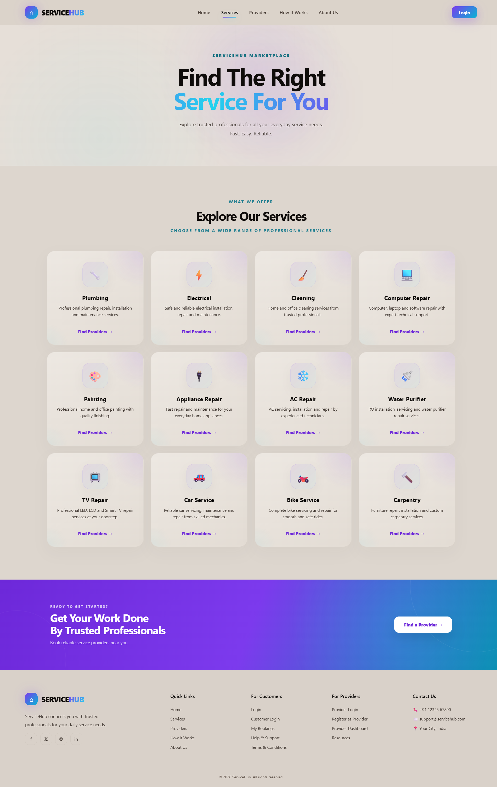
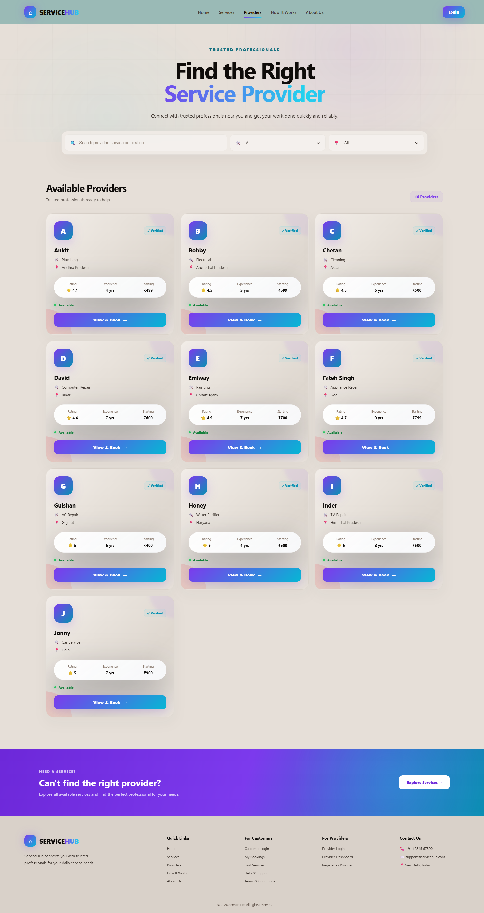
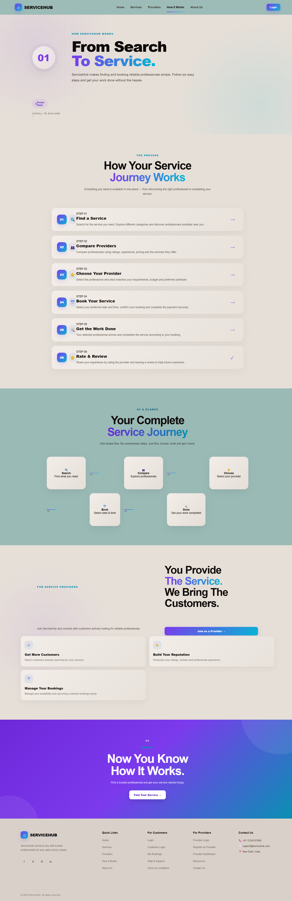
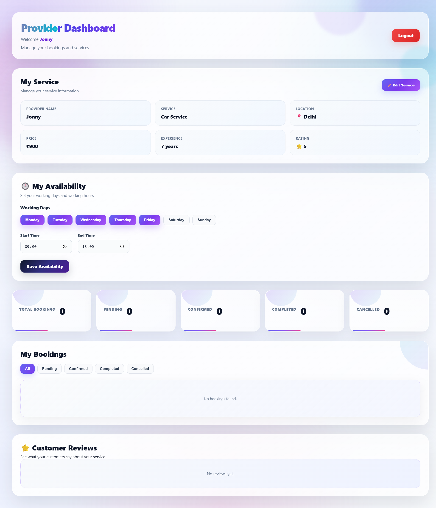
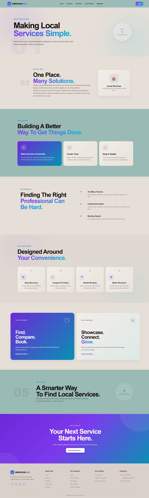
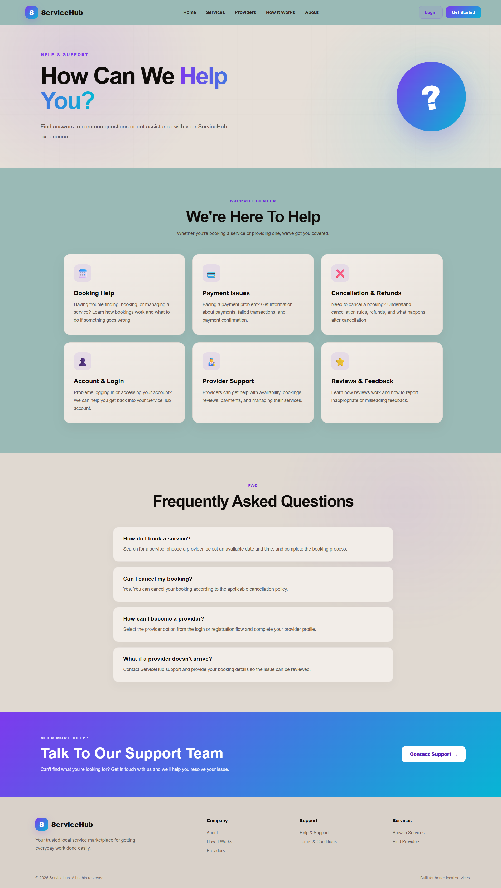
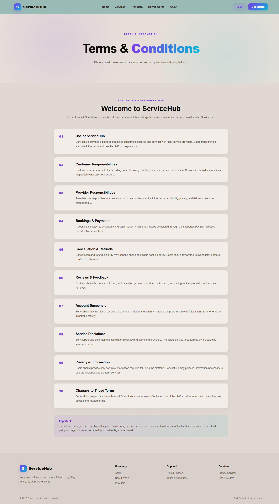

# 🚀 ServiceHub — Local Service Marketplace

<p align="center">
  <strong>Find Trusted Services Near You</strong>
</p>

<p align="center">
  A full-stack local service marketplace that connects customers with trusted service providers.
</p>

<p align="center">
  🔍 Search &nbsp; • &nbsp; 📅 Book &nbsp; • &nbsp; 💳 Pay &nbsp; • &nbsp; ⭐ Review
</p>

---

## 🌟 About ServiceHub

**ServiceHub** is a full-stack web application designed to make finding and booking local services simple, fast, and convenient.

Customers can search for services, explore service providers, check their availability, book appointments, make online payments, and submit reviews.

Service providers can manage their availability, view bookings, update booking status, and monitor customer reviews.

The platform also includes an **Admin Dashboard** for managing and monitoring the service marketplace.

---

## ✨ Key Features

### 👤 Customer Features

* 🔍 Search services by **service name and location**
* 👨‍🔧 Browse available service providers
* 📋 View provider details
* 💰 View service pricing
* ⭐ View provider ratings and experience
* 📅 Check provider availability
* 📝 Book services
* ⏰ Select preferred date and time
* 💳 Online payment using **Razorpay**
* 📖 View booking history
* ⭐ Submit reviews and ratings
* 🔔 Track booking status

---

### 👨‍🔧 Service Provider Features

* 🔐 Provider Login
* 📊 Dedicated Provider Dashboard
* 📅 Manage working days
* 🕐 Manage working hours
* 📋 View customer bookings
* ✅ Confirm bookings
* ✔️ Mark bookings as completed
* ❌ Cancel bookings
* ⭐ View customer reviews
* 💳 View payment status

---

### 🛠️ Admin Features

* 🔐 Secure Admin Login
* 📊 Admin Dashboard
* 👨‍🔧 Manage service providers
* 📋 Monitor bookings
* 📈 Monitor marketplace activity
* 🗂️ Manage platform data

---

## 💳 Payment Integration

ServiceHub uses **Razorpay** for online payments.

### Payment Flow

```text
Customer
   ↓
Select Service
   ↓
Choose Date & Time
   ↓
Create Booking
   ↓
Razorpay Payment
   ↓
Payment Verification
   ↓
Booking Confirmed
```

Payment verification is handled through the backend to provide a safer payment flow.

---

## 🧠 Booking System

The booking system includes validation to prevent invalid bookings.

It checks:

* 📅 Provider working days
* 🕐 Provider working hours
* ⏰ Selected appointment time
* 📞 Customer phone number
* 🚫 Duplicate time slots
* 💳 Payment status
* 📌 Booking status

### Booking Status

```text
Pending
   ↓
Confirmed
   ↓
Completed

       ↘ Cancelled
```

---

## ⭐ Review System

Customers can leave reviews for service providers after using their service.

Reviews include:

* ⭐ Rating
* 📝 Customer feedback
* 👨‍🔧 Provider association

Providers can view their received reviews from the Provider Dashboard.

---

# 🛠️ Technologies Used

## 🎨 Frontend

* **React.js**
* **Vite**
* **JavaScript**
* **HTML5**
* **CSS3**

## ⚙️ Backend

* **Node.js**
* **Express.js**

## 🗄️ Database

* **MongoDB Atlas**
* **Mongoose**

## 💳 Payment

* **Razorpay**

## 🔧 Development Tools

* **Git**
* **GitHub**
* **VS Code**
* **NPM**

---

# 🏗️ Project Architecture

```text
ServiceHub
│
├── client/
│   ├── public/
│   └── src/
│       ├── assets/
│       │
│       ├── Home.jsx
│       ├── Services.jsx
│       ├── Providers.jsx
│       ├── MyBookings.jsx
│       │
│       ├── CustomerLogin.jsx
│       ├── ProviderLogin.jsx
│       ├── ProviderDashboard.jsx
│       │
│       ├── AdminLogin.jsx
│       ├── Admin.jsx
│       │
│       ├── RoleSelection.jsx
│       ├── App.jsx
│       ├── AppRouter.jsx
│       │
│       └── CSS Files
│
├── server/
│   ├── models/
│   │   ├── Provider.js
│   │   └── Booking.js
│   │
│   ├── routes/
│   │   ├── providerRoutes.js
│   │   ├── bookingRoutes.js
│   │   └── adminRoutes.js
│   │
│   └── server.js
│
├── screenshots/
│   ├── home.png
│   ├── services.png
│   ├── providers.png
│   ├── booking.png
│   ├── provider-dashboard.png
│   └── admin-dashboard.png
│
└── README.md
```

---

# 📸 Screenshots

## 🏠 Home Page



---

## 🎭 Role Selection



---

## 🔍 Services Page



---

## 👨‍🔧 Providers Page



---

## 📖 How It Works



---

## 👤 Customer Dashboard


---

## 👨‍💼 Provider Dashboard



---

## 🛠️ Admin Dashboard


---

## ℹ️ About Page



---

## 🆘 Help & Support



---

## 📜 Terms & Conditions




# ⚙️ Installation & Setup

## 1️⃣ Clone Repository

```bash
git clone https://github.com/Tanish-77/ServiceHub.git
```

```bash
cd ServiceHub
```

---

## 2️⃣ Install Frontend Dependencies

```bash
cd client
npm install
```

Start the frontend:

```bash
npm run dev
```

---

## 3️⃣ Install Backend Dependencies

Open another terminal:

```bash
cd server
npm install
```

Start the backend:

```bash
npm start
```

---

# 🔐 Environment Variables

Create a `.env` file inside the **server** folder.

Example:

```env
MONGO_URI=your_mongodb_connection_string

RAZORPAY_KEY_ID=your_razorpay_key_id

RAZORPAY_KEY_SECRET=your_razorpay_key_secret
```

> ⚠️ Never upload your actual `.env` file or secret keys to GitHub.

---

# 🔄 Application Flow

```text
                 SERVICEHUB
                     │
        ┌────────────┼────────────┐
        │            │            │
     Customer      Provider      Admin
        │            │            │
        ↓            ↓            ↓
    Search        Dashboard    Dashboard
        │            │            │
        ↓            ↓            ↓
   Providers     Availability   Management
        │            │
        ↓            ↓
     Booking ←──── Provider
        │
        ↓
     Payment
        │
        ↓
     Review
```

---

# 🔌 API Structure

### Provider APIs

```text
/api/providers
```

Used for provider-related operations and provider data.

### Booking APIs

```text
/api/bookings
```

Used for creating bookings, checking bookings and updating booking status.

### Admin APIs

```text
/api/admin
```

Used for administrative operations.

### Review APIs

```text
/api/reviews
```

Used for creating and retrieving provider reviews.

---

# 📱 Responsive Design

ServiceHub's interface is designed with responsive layouts so that the application can be adapted for different screen sizes.

The UI includes dedicated styling for:

* 🖥️ Desktop
* 💻 Laptop
* 📱 Mobile

---

# 🔮 Future Improvements

Some planned improvements include:

* 🔐 OTP-based authentication
* 👤 User profile management
* 🪪 Provider verification
* 🔔 Real-time notifications
* 💬 Customer-provider chat
* 📍 Map and location integration
* 🔎 Advanced service filters
* 📊 Advanced analytics
* 📱 Progressive Web App support

---

# 🎯 Project Goals

ServiceHub aims to:

* Make local service discovery easier
* Connect customers with service providers
* Simplify appointment booking
* Provide secure online payments
* Improve communication between customers and providers
* Provide a centralized platform for service management

---

# 👨‍💻 Developer

**Tanish Kalota**

Full Stack Development Project

---

<p align="center">
  ⭐ If you like this project, consider giving it a star!
</p>

<p align="center">
  Made with ❤️ using React, Node.js, Express & MongoDB
</p>
